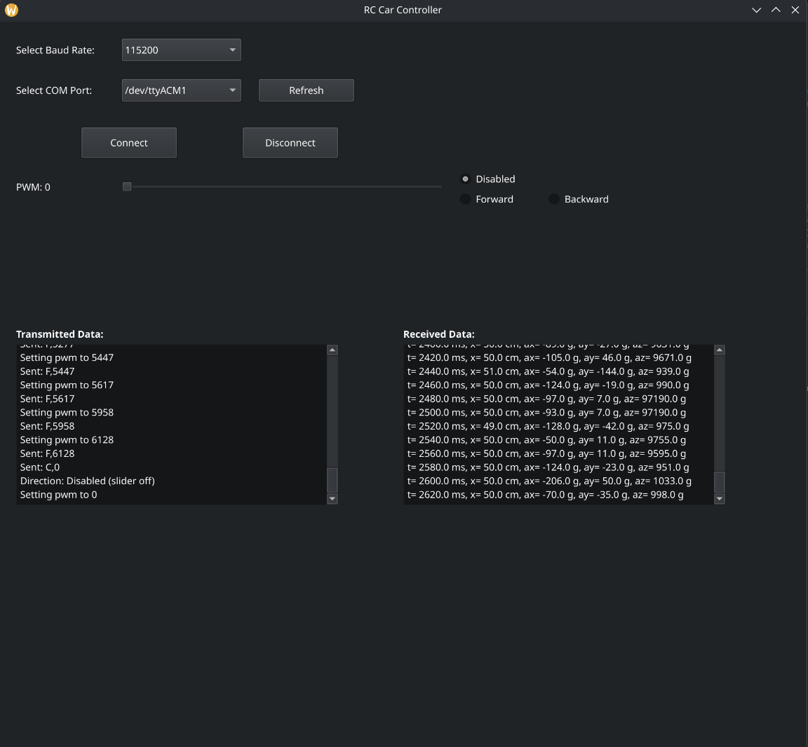
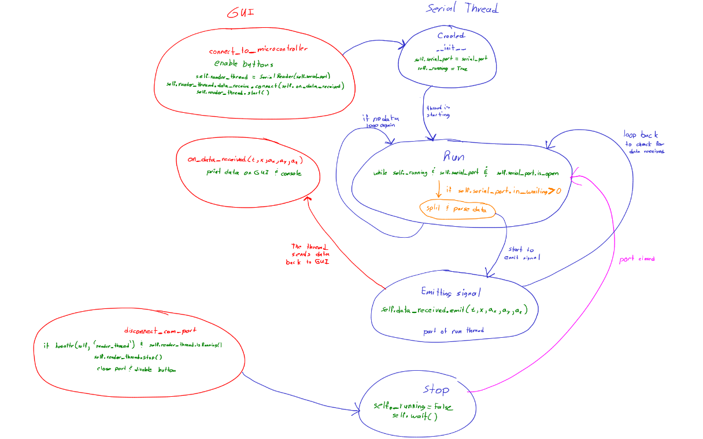

# Python GUI

## Overview
A Python GUI is developed in order to have software control, and data aquisition of the RC car sensor for analysis and also help tune the PID controller that  will integrated to the RC car 

## Packages Required in Python
The packages used for the GUI will primarily be PyQt5, and to communicate to the transmitter with the Nucleo-L432KC board by UART protocol will use pyserial. 

### As of 4/13/26
- The transmitter was able to successfully transmit the data it received from the RC Car by UART.
- The UART functionality and reliablility in toggling 10ms between Tx?Rx mode is successful. This was confirm by controlling motors with the GUI it started off with and alongside picocom was opened in the same time to view the data it received.

### As of 4/14/26
- A Rx texbox was added based on success on the previous day.
- Threading had to be add as a test run on print the data it received on the pycharm console.
- After getting the python GUI program to print the data on the console, the Rx textbox was able to display the data it received.
- Here is the current GUI below.

### As of 4/16/26
- Signal the GUI Requires more Threading controls a package the would support pyqt5 GUI threading feature is used as QtThreading.
- Same functionality as previous GUI using threading package.
- Added a custom import file known as RC_Car_SerialThread.py.
- Here is the state diagram on how it works.

