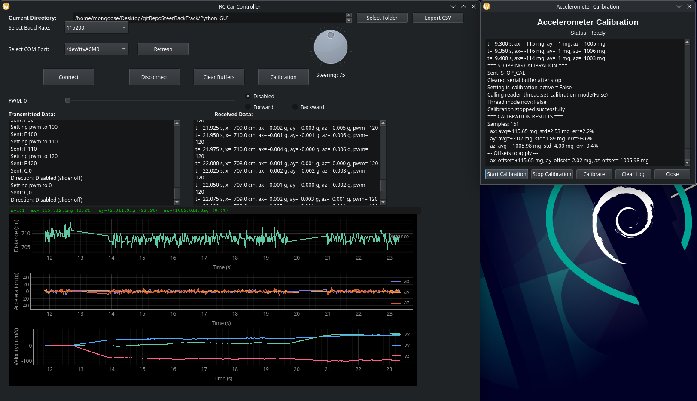
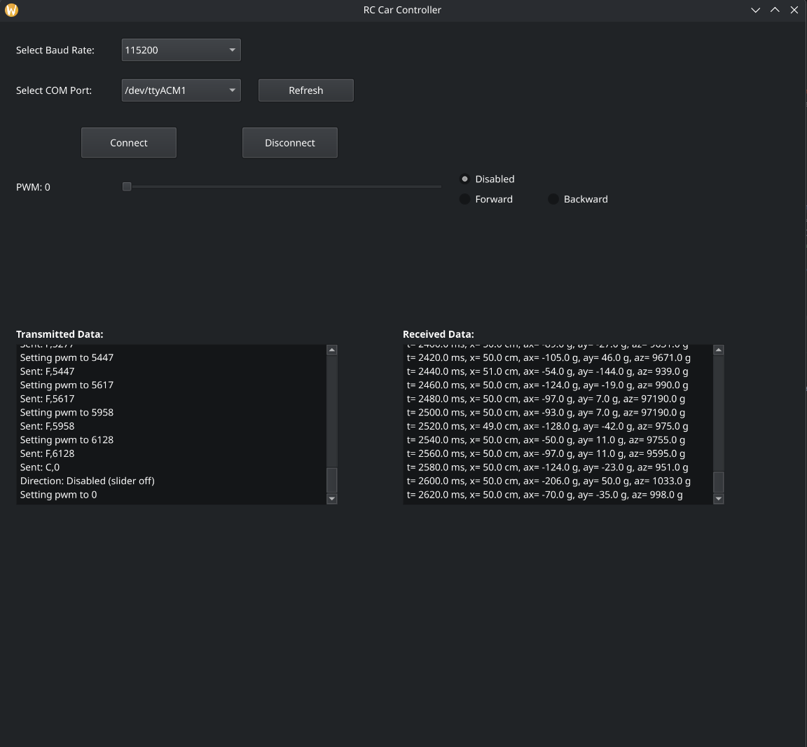
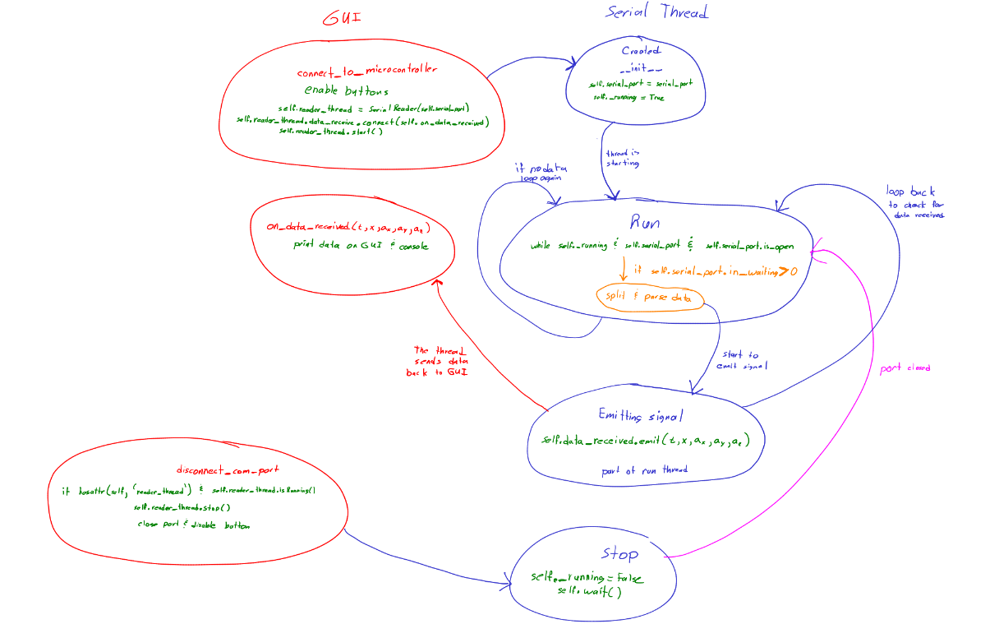
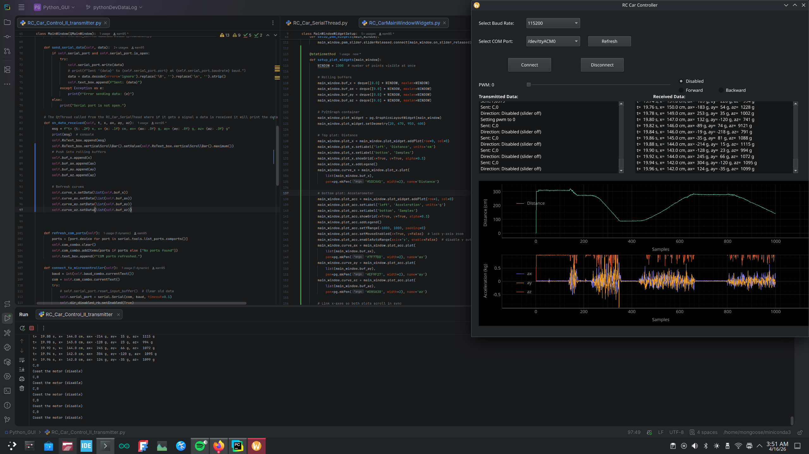

# Python GUI — RC Car Controller

## Overview

A Python-based graphical user interface is developed to provide software control
and real-time data acquisition of the RC Car sensors. The GUI enables the user
to send drive commands, control steering, calibrate the accelerometer, visualize
sensor data in real time, and export collected data to CSV for further analysis
and future implementation of PID controllers.

---

## Features

- Connect to the transmitter MCU over UART (USB serial)
- Send motor commands: Forward, Backward, Coast/Disable
- Control steering via a dial widget
- Real-time plots: LIDAR distance, accelerometer (ax, ay, az), and calculated velocity (vx, vy, vz)
- Accelerometer calibration window — collects stationary samples and claculates the offsets from Earth's gravitional pull
- Export data to CSV for post-processing and analysis
- Calibration results displayed persistently on the main window to offset the acceleration measurements

---

## File Structure

| File | Description |
|------|-------------|
| `RC_Car_Control_II_transmitter.py` | Main window — connects to serial port, handles all GUI logic |
| `RC_CarMainWindowWidgets.py` | Widget setup — modular layout for all UI elements |
| `RC_Car_CalibrationWindow.py` | Calibration dialog — collects IMU samples and computes offsets |
| `RC_Car_SerialThread.py` | Background QThread — reads serial port without blocking the GUI |

---

## Dependencies

Install all required packages with:

```bash
pip install PyQt5 pyqtgraph pyserial pandas
```

| Package | Purpose |
|---------|---------|
| `PyQt5` | GUI framework — windows, widgets, layouts, signals |
| `pyqtgraph` | Real-time plotting of sensor data |
| `pyserial` | UART communication with the STM32L432KC transmitter |
| `pandas` | CSV export of collected data |

---

## How to Run

### Linux
```bash
python RC_Car_Control_II_transmitter.py
```

### Windows
Navigate to `Python_GUI_Windows_Version/` and run:
```bash
python RC_Car_Control_II_transmitter_Windows.py
```

### PyCharm
Make sure the interpretter is python version 3.11 or above
---

## GUI Layout



*Figure 1: The Python user interface showing real-time sensor plots,
motor and steering controls, and the calibration window.*

---

## How to Use

### 1. Connect
- Select the correct **COM port** and **baud rate** (115200) from the dropdowns
- Click **Connect** — the transmitter MCU will begin forwarding RC Car data
- On Linux the port is typically `/dev/ttyACM0`, on Windows it is `COM3` or similar

### 2. Control the RC Car
- Select **Forward** or **Backward** radio button to enable the PWM slider
- Drag the **PWM slider** to set motor speed (0–65535 range matching TIM1 period)
- Turn the **steering dial** to steer left or right (50 = full left, 75 = center, 100 = full right)
- Select **Disabled** to coast the motor to a stop

### 3. Calibrate the Accelerometer
- With the RC Car stationary and on a flat surface, click **Calibration**
- Click **Start Calibration** — the RC Car enters calibration mode and transmits raw IMU data
- Wait for at least 20 samples to accumulate in the calibration log
- Click **Calibrate** — the GUI computes the mean offset and standard deviation for each axis
- Click **Stop Calibration** — the RC Car returns to normal operation
- The computed offsets are automatically applied to all subsequent acceleration readings

### 4. Export Data
- Click **Export CSV** to save all collected data to a file
- The CSV includes: Time (s), Distance (cm), ax, ay, az (mg), vx, vy, vz (m/s), PWM

---

## Data Packaged Format

Data received from the transmitter over UART:

**Normal telemetry (5 comma-separated values):**
```
timestamp_ms,distance_cm,ax_mg,ay_mg,az_mg
```

**Calibration data (4 comma-separated values):**
```
timestamp_ms,ax_mg,ay_mg,az_mg
```

The `SerialReaderThread` detects the packet type by field count and routes it
to the appropriate signal — `data_received` for normal data and
`calibration_data_received` for calibration data.

---

## Architecture

The GUI uses a producer-consumer threading model to keep the interface
responsive while reading serial data continuously in the background.

```
SerialReaderThread (QThread)
    └── reads serial port in background
    └── signals the emits data_received or calibration_data_received
            │
            ▼
MainWindow (Qt main thread)
    └── on_data_received()         → updates plots and text boxes
    └── on_calibration_data_received() → routes to CalibrationWindow log
```

The `SerialReaderThread` detects packet type by field count:
- 4 fields → calibration packet → `calibration_data_received` signal
- 5 fields → normal telemetry → `data_received` signal

---

## Velocity Estimation

Velocity is estimated by numerically integrating the accelerometer readings
using the Euler method:

```
v(t) = v(t-1) + a(t) × dt
```

where `a` is converted from millig to m/s² by multiplying by `0.001 × 9.81`.
All three axes (vx, vy, vz) are integrated independently and plotted in real time.

**Known limitation:** Integration drift accumulates over time. When the RC Car
is stationary, the velocity estimate slowly grows due to sensor noise and
gravitational bias on the tilted accelerometer. The calibration feature reduces
this drift by subtracting the stationary axis offsets before integration, but
drift is not fully eliminated. Sensor fusion with a Hall effect sensor or GPS
can potentially be used to accurately estimate.

---

## Development Log

### 13 April 2026
The transmitter successfully transmitted RC Car sensor data over UART to the
Python console. UART reliability at 10ms TX/RX toggle was confirmed by running
the GUI alongside `picocom` simultaneously.

### 14 April 2026
A received data text box was added to the GUI. Threading was introduced to
print received data to the PyCharm console without blocking the UI, and the
text box was successfully populated with live data.



*Figure 2: Early GUI showing the received data text box operational.*

### 15 April 2026
Qt threading (`QThread`) replaced the generic threading package to avoid
conflicts with PyQt5's event loop. `RC_Car_SerialThread.py` was introduced as
a dedicated serial reader thread. The state diagram below shows how the serial
thread interacts with the main window.



*Figure 3: State diagram of the serial thread and GUI interaction.*

### 16 April 2026
Code was modularized into separate files. Real-time plotting of distance,
acceleration, and velocity was added using PyQtGraph.



*Figure 4: Real-time sensor data plot added to the GUI.*

### 28 April 2026
Velocity integration was added and plotted in real time. Drift was observed
even when the RC Car was stationary, attributed to sensor noise and the tilted
mounting angle of the accelerometer. The plot window was set to 10,000 points
(approximately 100 seconds at 20ms sample rate) before rolling over.
