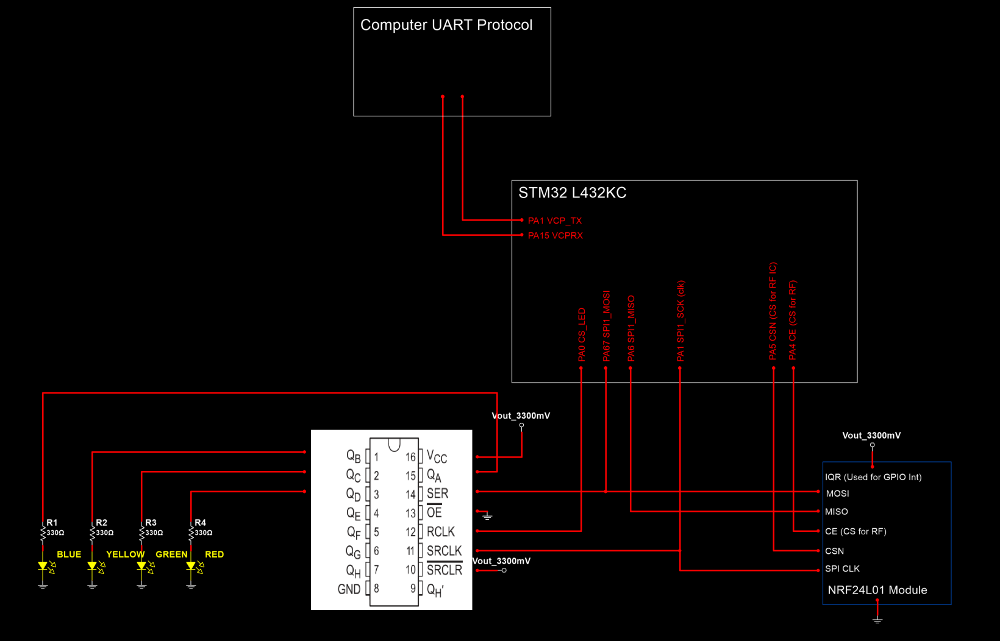

# Transmitter Firmware — STM32L432KC Nucleo Board

## Overview

The Transmitter firmware runs on the STM32L432KC Nucleo board and serves as the
wireless relay between the Python user interface and the RC Car. It receives
commands from the Python GUI over UART and forwards them to the RC Car via the
NRF24L01 radio. In the opposite direction, it receives sensor telemetry packets
from the RC Car over the radio and forwards them to the Python GUI over UART for
real-time data logging and visualization.

---

## Hardware Components

| Component | Part | Protocol | Purpose |
|-----------|------|----------|---------|
| Microcontroller | STM32L432KC Nucleo | — | Main processing unit |
| RF Module | NRF24L01 | SPI | Bidirectional wireless communication with RC Car |
| LED Driver | SN74HCT595 8-Bit Shift Register | SPI | Status LEDs for state machine debugging |
| PC Connection | Micro-USB | UART 115200 baud | Communication with Python GUI |

### LED State Indicators

| LED Color | Meaning |
|-----------|---------|
| Blue | Transmitter is in RX mode (listening for RC Car data) |
| Yellow | Transmitter is in TX mode (sending command to RC Car) |
| Red | Data packet received from RC Car |
| Green | Command received from Python GUI and ready to transmit |

---

## Peripheral Map

| Peripheral | Function | Details |
|------------|----------|---------|
| SPI1 | NRF24L01 + SN74HCT595 | Shared SPI bus, chip select per device |
| USART2 | UART to Python GUI | 115200 baud, DMA receive |
| TIM6 | Comm state toggle ISR | 10ms period — drives RX/TX alternation |
| TIM7 | Microsecond delay | Free-running counter for `delay_us()` |

---

## Schematic



*Figure 1: Transmitter schematic. The design is simpler than the RC Car —
the STM32L432KC Nucleo board connects to the NRF24L01 RF module over SPI and
to the SN74HCT595 shift register for LED status indicators. A Micro-USB cable
provides UART communication to the PC running the Python user interface.
No power isolation is required since the transmitter only handles digital
signals.*

---

## Packet Format

### Received from RC Car (NRF24L01 → UART to GUI)

The transmitter receives 32-byte CSV packets from the RC Car and forwards them
directly over UART to the Python GUI:

**Normal telemetry (5 fields):**
```
timestamp_ms,distance_cm,ax_mg,ay_mg,az_mg\n
```

**Calibration data (4 fields):**
```
timestamp_ms,ax_mg,ay_mg,az_mg\n
```

### Sent to RC Car (UART from GUI → NRF24L01)

Commands are received from the Python GUI as 32-byte padded strings and
forwarded to the RC Car over NRF24L01:

| Command | Description |
|---------|-------------|
| `F,<pwm>` | Drive forward at given PWM value |
| `R,<pwm>` | Drive backward at given PWM value |
| `B,<pwm>` | Brake |
| `C,0` | Coast (disable motor) |
| `S,<value>` | Set steering servo position |
| `CAL` | Start accelerometer calibration on RC Car |
| `STOP_CAL` | Stop accelerometer calibration |

---

## State Machine

The firmware is driven by a state machine toggled by the TIM6 ISR every 10ms.
The radio alternates between RX mode (listening for RC Car telemetry) and TX
mode (sending commands from the GUI to the RC Car).

*(State machine diagram — to be added)*

### States

| State | Description |
|-------|-------------|
| `STATE_WAIT` | Idle — waiting for TIM6 ISR or UART interrupt |
| `STATE_SET_RECEIVE_MODE` | Switches NRF24L01 to RX mode, turns on blue LED |
| `STATE_RECEIVE` | Polls for incoming RC Car data packet, forwards over UART if received |
| `STATE_SET_TRANSMIT_MODE` | Switches NRF24L01 to TX mode, turns on yellow LED |
| `STATE_TRANSMIT` | Transmits pending GUI command to RC Car if `cmdFlag` is set |
| `STATE_DATA_ACQUISITION` | Stores received packets in buffer up to 1000 points |
| `STATE_FORCE_RC_STOP` | Sends coast command to RC Car after buffer limit reached |

### Interrupt Sources

| Interrupt | Trigger | Action |
|-----------|---------|--------|
| TIM6 ISR (10ms) | Periodic timer | Alternates between `STATE_SET_TRANSMIT_MODE` and `STATE_SET_RECEIVE_MODE` |
| UART DMA RxCplt | Full 32-byte UART packet received from GUI | Sets `cmdFlag=1`, transitions to `STATE_TRANSMIT` immediately |
| GPIO EXTI (IRQ pin) | NRF24L01 data ready interrupt | Confirms data available in RX FIFO |

---

## Functionalities

### Bidirectional Communication

The NRF24L01 radio alternates between RX and TX mode every 10ms driven by the
TIM6 periodic interrupt using a `toggleFlag`. When `toggleFlag == 0` the
transmitter enters TX mode to send any pending GUI command. When
`toggleFlag == 1` it enters RX mode to listen for incoming RC Car telemetry.
This gives each direction a 10ms window per 20ms cycle.

### Receiving Data from RC Car

While in `STATE_RECEIVE`, the firmware polls `nrf24_data_available()`. When a
packet arrives, the 32-byte payload is read from the NRF24L01 FIFO, parsed into
timestamp, distance, and acceleration fields, and immediately forwarded to the
Python GUI over UART using `HAL_UART_Transmit()`. The red LED toggles on each
received packet.

### Sending Commands to RC Car

The Python GUI sends 32-byte padded command strings over UART to the
transmitter. The UART DMA completion callback fires, copies the received bytes
into the command buffer, sets `cmdFlag = 1`, and immediately transitions the
state machine to `STATE_TRANSMIT`. On the next TX window, the command is
forwarded to the RC Car via `nrf24_transmit()`. The green LED indicates a
command was received from the GUI.

### LED Status Indicators

The SN74HCT595 shift register drives 4 status LEDs over SPI. A single byte is
written to the shift register to set all LED states simultaneously, providing
a low-overhead visual indicator of the transmitter's current state without
requiring dedicated GPIO pins.

---

## Installation

Built with **STM32CubeIDE** on Debian Linux.

1. When cloning the project, the Transmitter and RC Car are locally in the same folder, where opening the STM32CubeIDE the workspace can accessed in the same folder it was cloned. 
2. On STM32CubeIDE and select **File → Import → Existing Projects into Workspace**
3. Navigate to the `RC_Car_Transmitter_L432KC/` folder and import the project
4. Build and flash to the STM32L432KC Nucleo board via Micro-USB

**Note for Debian users:** If the debugger fails to launch, open the Debug
launch configuration and go to line 65. Change:
```
arm-none-eabi-gdb
```
to:
```
gdb-multiarch
```
Then install multiarch gdb if not already present:
```bash
sudo apt install gdb-multiarch
```
