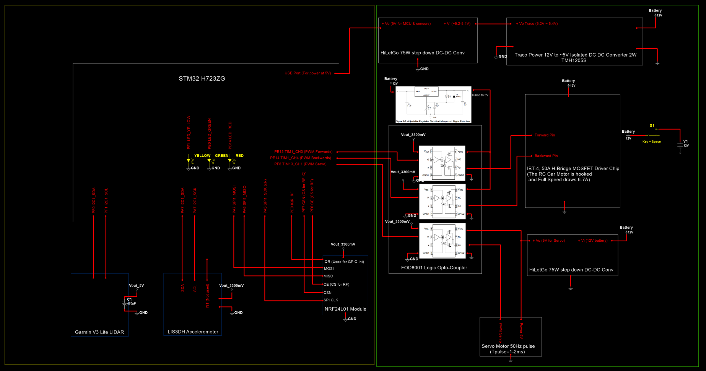

# RC Car Firmware — STM32H723ZG Nucleo Board

## Overview

The RC Car firmware runs on the STM32H723ZG Nucleo board and is responsible for
receiving commands from the Python user interface via the transmitter, reading
sensor data, controlling the DC motor and steering servo, and transmitting
telemetry back to the transmitter. The long-term objective is to develop an
Adaptive Cruise Control system where the RC Car drives autonomously at a tuned
speed and slows down or stops upon detecting a stationary object or vehicle ahead
using the LIDAR sensor.

---

## Hardware Components

| Component | Part | Protocol | Purpose |
|-----------|------|----------|---------|
| Microcontroller | STM32H723ZG Nucleo | — | Main processing unit |
| RF Module | NRF24L01 | SPI | Bidirectional wireless communication with transmitter |
| LED Driver | SN74HCT595 8-Bit Shift Register | SPI | Status LEDs for state machine debugging |
| Distance Sensor | Garmin LIDAR Lite V3 | I2C | Measures distance up to 40m ahead |
| Accelerometer | LIS3DH | SPI | Measures acceleration for velocity estimation |
| Motor Driver | IBT-4 50A H-Bridge MOSFET | PWM 4kHz | Controls DC motor forward/backward/brake/coast |
| Signal Isolator | FOD8001 Logic Optocoupler | — | Isolates MCU from motor power circuit |
| MCU Power Supply | TMH1205S Traco Isolated DC-DC | — | Powers MCU with isolated ground from power circuit |
| Step-Down Converter | HiLetgo DC/DC 75W | — | Steps down battery voltage |
| Voltage Regulator | LM317 Adjustable | — | Regulated voltage supply |
| Battery | Rapthor BP007 12V 5200mAh Li-ion | — | Main power source |
| Steering | Servo Motor | PWM 50Hz (1–2ms pulse) | Controls steering angle |
| Drive | DC Motor | PWM | Drives the RC Car |

---

## Peripheral Map

| Peripheral | Function | Details |
|------------|----------|---------|
| SPI1 | NRF24L01 + SN74HCT595 | Shared SPI bus, chip select per device |
| I2C2 | Garmin LIDAR Lite V3 | 400kHz Fast Mode |
| I2C1 | LIS3DH Accelerometer | SPI mode configured |
| TIM3 | Comm state toggle ISR | 10ms period — drives RX/TX alternation |
| TIM1 CH3/CH4 | DC Motor PWM | 4kHz, dual channel for H-bridge direction |
| TIM13 CH1 | Servo Motor PWM | 50Hz, 1–2ms pulse width |
| TIM24 | Microsecond delay | Free-running counter for `delay_us()` |
| USART3 | Debug UART | 115200 baud, serial print to PC |

---

## Schematic



*Figure 1: RC Car schematic powered by a 12V rechargeable battery. The yellow box
contains the STM32H723ZG Nucleo board and all sensor connections using digital
ground. The green box contains the power circuit using power ground. The two
grounds are kept isolated by the TMH1205S Traco Power DC-DC converter which
powers the MCU, and the FOD8001 optocouplers which pass PWM signals across the
isolation boundary to control the servo motor and DC motor.*

---

## Packet Format

Sensor data is packed into a 32-byte ASCII CSV string and transmitted over NRF24L01:

**Normal data packet (5 fields):**

```
timestamp_ms,distance_cm,ax_mg,ay_mg,az_mg\n
```

**Calibration data packet (4 fields, sent only during CAL mode):**

```
timestamp_ms,ax_mg,ay_mg,az_mg\n
```

| Field | Unit | Description |
|-------|------|-------------|
| timestamp_ms | ms | Time since boot |
| distance_cm | cm | LIDAR distance measurement |
| ax_mg | mg | X-axis acceleration |
| ay_mg | mg | Y-axis acceleration |
| az_mg | mg | Z-axis acceleration |

---

## State Machine

The firmware is driven by a state machine toggled by the TIM3 ISR every 10ms.
The radio alternates between RX mode (listening for commands) and TX mode
(transmitting sensor data). The diagram below shows the full state flow.

*(State machine diagram — to be added)*

### States

| State | Description |
|-------|-------------|
| `WAIT_STATE` | Idle — waiting for TIM3 ISR to trigger next comm cycle |
| `CHANGE_RX_STATE` | Switches NRF24L01 to receive mode |
| `RX_STATE` | Listens for incoming command from transmitter, parses it |
| `CHANGE_TX_STATE` | Switches NRF24L01 to transmit mode |
| `TX_STATE` | Checks if a valid command was received, enters sensor read if so |
| `GET_SENSOR_DATA_STATE` | Reads LIDAR and accelerometer, packages and transmits data |
| `FORWARD_STATE` | Sets motor PWM for forward direction |
| `BACKWARD_STATE` | Sets motor PWM for reverse direction |
| `BRAKE_STATE` | Applies braking via H-bridge |
| `COAST_STATE` | Disables motor output (coast to stop) |
| `STEER_STATE` | Updates servo PWM for steering angle |
| `STATE_ACCEL_CALIBRATION` | Transmits raw accelerometer data for offset calibration |
| `STATE_FORCE_STOP` | Forces motor stop after data acquisition limit reached |

### Commands Received from Transmitter

| Command | Action |
|---------|--------|
| `F,<pwm>` | Drive forward at given PWM value |
| `R,<pwm>` | Drive backward at given PWM value |
| `B,<pwm>` | Brake |
| `C,0` | Coast (disable motor) |
| `S,<value>` | Set steering servo position |
| `CAL` | Enter accelerometer calibration mode |
| `STOP_CAL` | Exit calibration mode, return to normal operation |

---

## Functionalities

### Bidirectional Communication

The NRF24L01 radio alternates between RX and TX mode every 10ms driven by the
TIM3 periodic interrupt. This allows the RC Car to both receive commands from
the Python user interface and transmit sensor telemetry back to the transmitter
in a time-division scheme. Data is received and transmitted at approximately
40ms intervals.

### Motor Control

The DC motor is controlled by the IBT-4 H-Bridge driver through TIM1 PWM at
4kHz. TIM1 Channel 3 and Channel 4 control forward and reverse direction
respectively. The motor is electrically isolated from the MCU by the FOD8001
optocoupler to prevent switching noise from coupling into the sensor and
communication circuits.

### Steering Control

The servo motor is controlled by TIM13 Channel 1 at 50Hz with a pulse width
between 1ms and 2ms. The center position corresponds to a 75% duty value, with
50 turning fully left and 100 turning fully right. The steering value received
from the transmitter is inverted before applying to the servo to correct for
mounting orientation.

### Sensor Data Acquisition

When a forward or backward command is received, the RC Car enters
`GET_SENSOR_DATA_STATE` on every TX cycle. In this state the LIDAR distance
and accelerometer X/Y/Z readings are sampled, timestamped, packaged into a
32-byte CSV string, and transmitted wirelessly to the transmitter which forwards
them to the Python GUI over UART.

### Accelerometer Calibration

A calibration mode is triggered by the `CAL` command. In this mode the RC Car
transmits raw accelerometer data (without distance) at the normal 40ms rate
while stationary. The Python GUI collects the samples, computes the mean and
standard deviation for each axis, and applies the offsets to subsequent
measurements to reduce the effect of gravitational bias on velocity estimation.
Calibration is stopped by the `STOP_CAL` command.

---

## Installation

Built with **STM32CubeIDE** on Debian Linux.

1. Open STM32CubeIDE and select **File → Import → Existing Projects into Workspace**
2. Navigate to the `rc_car_integrated_II/` folder and import the project
3. Build and flash to the STM32H723ZG Nucleo board

**Note for Debian users:** If the debugger fails to launch, open the Debug
launch configuration and go to line 65. Change:
```
arm-none-eabi-gdb
```
to:
```
gdb-multiarch
```
Then install multiarch gdb if not already present:
```bash
sudo apt install gdb-multiarch
```
